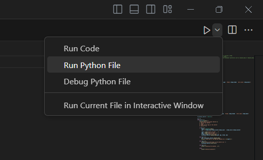
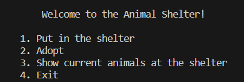
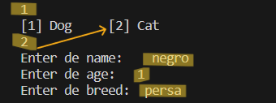
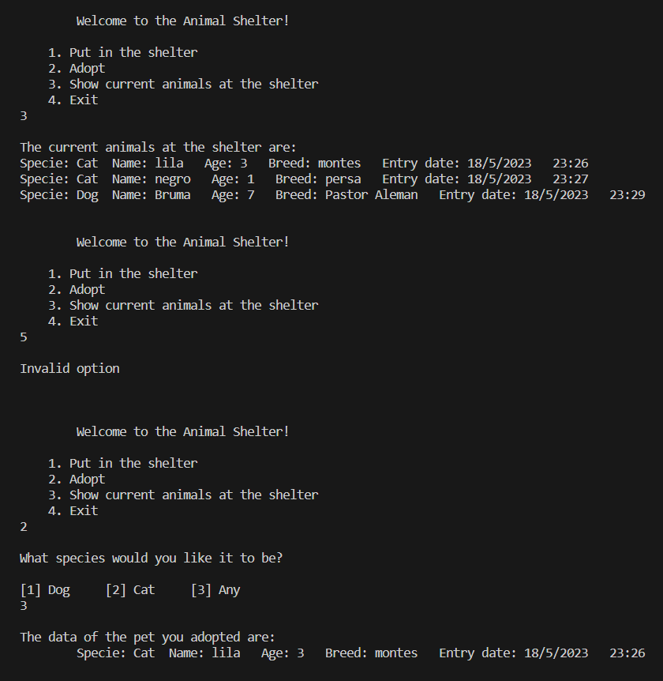
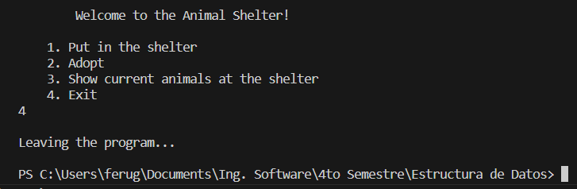

<!-- - Una buena documentación inicia definiendo su alcance y su audiencia.
- Si es un documento largo, se menciona en un resumen los puntos clave que se tocan en el documento.
- La redacción debe ser con base en la audiencia a la que va dirigido el documento.
- Utiliza elementos adecuados como listas ordenadas o numeradas (cuando sea necesario), tablas, imagenes, etc.--> 

# **Documentación técnica del código _'Animal_Shelter'_**


## Un refugio de perros opera con el método de __Cola__ o __FIFO__ (First in, first out), es decir, las personas deben adoptar al primer perro que llegó al refugio.

## En este algoritmo se crea una estructura de datos en la que se simula un refugio de animales, por lo cual tiene el objetivo de mantener el sistema e implementar operaciones de agregar, adoptar y ver la lista actual de perros en el refugio.
### Este documento está dirigido a público con conocimientos básicos del lenguaje Python 

### **<br>Índice**
- [Conceptos generales](#a-conceptos-generales)
- [Descripción del código](#b-descripción-del-código)
    - Clase __Dog__
    - Clase __Shelter__
    - Main (Clase principal)
- [Instrucciones para ejecutar/probar el código](#c-instrucciones-para-ejecutarprobar-el-código)

<br>

### **a) Conceptos generales**
Este código hace uso de los conceptos de la programación orientada a objetos, aplicándolos para la creación de una Cola (Queue) que se rigue por el método FIFO. Se pueden distinguir los siguientes conceptos:
- Clases: Agrupación de datos y métodos que operan sobre objetos, siendo las plantillas de características comunes. Dentro del código se definen dos clases que son __Dog__ y __Shelter__.
- Instanciar: Crear un objeto que posea los atributos y sea capaz de realizar las acciones dentro de una clase. En el código se crean objetos de la clase __Dog__ las cuales representan a los perros y un objeto de la clase __Shelter__ representando el sistema del refugio.
- Constructor: Es un método que inicializa los miembros obligatorios de una clase.
- Métodos: Las acciones definidas dentro de una clase que operarán sobre las variables de instancia. En la clase __Shelter__ se encuentran __print_list()__, __enqueue_dog()__ y __dequeue_dog()__.


<br>

### **b) Descripción del código**
Para la elaboración de éste código, solo se importa la librería _datetime_, con la única finalidad de agregar como dato la fecha y hora del ingreso del perro al refugio.
```python
from datetime import datetime
```
1. La primer clase que se crea es la de __Dog__ la cual contiene solamente su constructor '\__init()__' que inicializa las propiedades del perro, por lo que cada que sea instanciada, deberá recibir como parámetros el nombre, edad, raza y fecha de ingreso. Además de esto, se fija un 'next' con el cual se hará un nodo o la conexión al siguiente perro que sea ingresado y así ir construyendo la estructura con la que se opera. Dicho de otra manera, esta clase es la que se utiliza para crear objetos que representan a los perros con el atributo de direccionarse al siguiente nodo. 
    ```python
    class Dog:

        def __init__(self, name, age, breed, date):
            self.name = name
            self.age = age
            self.breed = breed
            self.date = date
            self.next = None
    ```
2. La siguiente clase que tenemos es la de __Shelter__ utilizada para crear el objeto que representa al refugio, esta clase contiene su constructor '\__init()__' inicializando sus propiedades como lo son la longitud de la lista y los punteros 'first' y 'last' dirigiéndose al primer y último perro en la lista. Además, en esta clase se encuentran tres métodos diseñados para que el refugio de perros opere:
    1. ```python
        def print_list(self):
            temp = self.first
            while temp is not None:
                print(f"Name: {temp.name}   Age: {temp.age}   Breed: {temp.breed}   Entry date: {temp.  date}")
                temp = temp.next
        ```
        Muestra los perros que se encuentran actualmente en la lista del refugio. El método inicia con el primer perro de la lista, recorriéndose uno a uno por medio de un ciclo _while_ hasta llegar al último. 

    2. ```python
        def enqueue_dog(self, name, age, breed, date):

            new_dog = Dog(name, age, breed, date)

            if self.length == 0:
                self.first = new_dog
                self.last = new_dog
            else:
                self.last.next =  new_dog
                self.last = new_dog
            self.length += 1 
        ```
        Es el método encargado de agregar un perro al final de la lista del refugio, creando un nuevo objeto __Dog__ proporcionando los parámetros necesarios e ingresándolo en el nodo 'next' del apuntador 'last'. En caso que la lista se encuentre vacía, el perro ingresado se convertirá en el primer y último perro de la lista, mientras no sea añadido otro. 

    3. ```python
    
        def dequeue_dog(self):
            if self.length == 0:
                return "Sorry! There are no more dogs"

            if self.first == self.last:
                temp = self.first
                self.first = None
                self.last = None
        
            else:
                temp = self.first
                self.first = temp.next
                temp.next = None
            self.length -= 1    
            return f"Name: {temp.name}   Age: {temp.age}   Breed: {temp.breed}   Entry date: {temp.date}"
        ```
        La función de este método es la de retirar al primer perro de la lista del refugio retornando sus datos, simulando su adopción. Por lo tanto, este perro es eliminado de la lista, a lo que el puntero 'first' se actualiza para que se dirija al siguiente perro. En caso que únicamente se encuentre un perro, una vez hecho el proceso, la lista quedará vacía por lo que los punteros 'first' y 'last' apuntarán a _None_. Por otro lado, si la lista ya se encontraba vacía, se retornará un mensaje notificando esto.

3. Ahora bien, en el programa principal primero se instancia la clase __Shelter__ en el objeto __my_animal_shelter__, que será el objeto con el cual se estarán llamando las acciones que se encuentran dentro de la clase. Prosiguiendo con la utilización de un bucle _while_ para mostrar al usuario un menú de opciones y procesar su selección. Las opciones mostradas al usuario son correspondientes a los métodos con los que opera el refugio, incluyendo en este menú el agregar un perro, adoptar, mostrar la lista actual y salir del programa con el cual se da fin al cilo _while_.
Al elegir agregar a un perro, se hace uso de la biblioteca _datetime_ para así obtener la fecha y hora del ingreso del animal, así mismo, se solicita ingresar el nombre, la edad y raza del perro para agregar todos estos parámetros a la entrada del perro, a manera de invocar al método responsable de añadir a la lista del refugio un perro con:
    ```python 
    my_animal_shelter.enqueue_dog(name, age, breed, day)
    ```
    Cuando se adopta a un perro, se despliega la información del perro que se adoptó, recordando que es aquel que tiene mayor antigüedad en el refugio. Esto se logra designando a una variable el valor de retorno de método correspondiente y que sea esta variable la que se imprima, viéndose en código de la siguiente manera:
    ```python 
    get = my_animal_shelter.dequeue_dog()
    print(f'\nThe data of the dog you adopted are: \n\t{get}\n')
    ```
    Si se elige la opción de mostrar la lista del refugio, únicamente se llama a dicho método por medio del objeto creado en un inicio:
    ```python 
    my_animal_shelter.print_list()
    ```
    En caso que se seleccione un opción fuera de las mostradas en el menú, se mostrará un mensaje de error y dejará que el usuario seleccione nuevamente. 

<br>

### **c) Instrucciones para ejecutar/probar el código**
1. Correr el código en terminal.

    

2. El programa mostrará un menú con cuatro opciones
    - "1. Put in the shelter", permite el ingreso de información sobre un perro que será añadido al refugio.
    - "2. Adopt", permite la adopción de un perro, siendo el que cuente con mayor antigüedad dentro del refugio.
    - "3. Show current dogs at the shelter", muestra la lista actual de los perros con los que cuenta el refugio.
    - "4. Exit", sale del programa.

    

3. Selecciona una de las opciones ingresando por teclado el número correspondiente y sigue las instrucciones que se muestran en pantalla.

    

4. El paso 2 y 3 serán los que se repitan hasta que decida pasar al paso 5.

    

5. Una vez que haya terminado de usar el programa, seleccione la opción "Exit", ingresando el número 4 para salir del programa.

    
    

**<br>Nota:** Cada vez que se finalice el programa, los datos anteriormente ingresados serán eliminados automáticamente.
